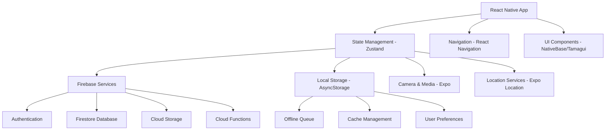

# Mobile App Development Design Document

## Overview

The EcoConnect mobile application will be built using React Native with Expo for cross-platform compatibility, leveraging Firebase for backend services and implementing a robust offline-first architecture. The app will provide native mobile experiences while maintaining feature parity with the web platform, focusing on enhanced camera integration, location services, and gamification elements optimized for mobile users.

## Architecture

### High-Level Architecture



### Technology Stack

- **Framework**: React Native with Expo SDK 49+
- **State Management**: Zustand for global state, React Query for server state
- **Navigation**: React Navigation v6
- **UI Library**: NativeBase or Tamagui for consistent design system
- **Backend**: Firebase (Auth, Firestore, Storage, Functions)
- **Camera**: Expo Camera with custom ML integration
- **Maps**: React Native Maps with Google Maps
- **Notifications**: Expo Notifications
- **Storage**: AsyncStorage for local data, SecureStore for sensitive data
- **Testing**: Jest, React Native Testing Library, Detox for E2E

## Components and Interfaces

### Core Components

#### 1. Camera Module
```typescript
interface CameraComponentProps {
  onImageCapture: (imageUri: string) => void;
  onAnalysisComplete: (result: AIResponse) => void;
  isAnalyzing: boolean;
}

interface CameraService {
  captureImage(): Promise<string>;
  analyzeImage(imageUri: string): Promise<AIResponse>;
  processOfflineQueue(): Promise<void>;
}
```

#### 2. Location Services
```typescript
interface LocationService {
  getCurrentLocation(): Promise<Location>;
  findNearbyVendors(location: Location, radius: number): Promise<Vendor[]>;
  getNavigationUrl(destination: Vendor): string;
}

interface Location {
  latitude: number;
  longitude: number;
  accuracy?: number;
}
```

#### 3. Offline Management
```typescript
interface OfflineManager {
  queueAction(action: OfflineAction): void;
  syncPendingActions(): Promise<void>;
  getCachedData<T>(key: string): Promise<T | null>;
  setCachedData<T>(key: string, data: T): Promise<void>;
}

interface OfflineAction {
  id: string;
  type: 'WASTE_CLASSIFICATION' | 'PROFILE_UPDATE' | 'VENDOR_RATING';
  payload: any;
  timestamp: number;
  retryCount: number;
}
```

#### 4. Gamification System
```typescript
interface GamificationService {
  calculatePoints(wasteType: WasteType, confidence: number): number;
  checkAchievements(userStats: UserStats): Badge[];
  sendNotification(type: NotificationType, data: any): void;
}

interface UserStats {
  totalWasteClassified: number;
  carbonOffsetAchieved: number;
  streakDays: number;
  level: number;
}
```

### Screen Components

#### 1. Home Screen
- Quick camera access button
- Recent activity feed
- Current points and level display
- Nearby vendors map preview
- Community challenges widget

#### 2. Camera Screen
- Full-screen camera view with overlay
- Real-time analysis feedback
- Capture button with haptic feedback
- Gallery access for existing photos
- Offline indicator and queue status

#### 3. Profile Screen
- User statistics and achievements
- Points history and redemption options
- Settings and preferences
- Offline data sync status
- Environmental impact visualization

#### 4. Vendors Screen
- Interactive map with vendor markers
- List view with distance sorting
- Vendor details with ratings and reviews
- Navigation integration
- Filter options by vendor type

#### 5. Leaderboard Screen
- Community rankings
- Friend comparisons
- Challenge participation
- Achievement showcases
- Social sharing features

## Data Models

### Enhanced User Model
```typescript
interface MobileUser extends User {
  deviceInfo: {
    platform: 'ios' | 'android';
    version: string;
    pushToken?: string;
  };
  preferences: {
    notifications: NotificationPreferences;
    cameraSettings: CameraSettings;
    locationSharing: boolean;
  };
  offlineData: {
    lastSyncTimestamp: number;
    pendingActions: OfflineAction[];
    cachedVendors: Vendor[];
  };
}
```

### Offline Queue Model
```typescript
interface OfflineQueue {
  id: string;
  userId: string;
  actions: OfflineAction[];
  lastSyncAttempt: number;
  syncStatus: 'pending' | 'syncing' | 'failed' | 'completed';
}
```

### Analytics Model
```typescript
interface AppAnalytics {
  userId: string;
  sessionId: string;
  events: AnalyticsEvent[];
  deviceMetrics: DeviceMetrics;
  performanceMetrics: PerformanceMetrics;
}
```

## Error Handling

### Network Error Handling
- Implement exponential backoff for failed requests
- Queue actions when offline and retry when online
- Provide clear user feedback for network issues
- Graceful degradation for non-critical features

### Camera Error Handling
- Handle camera permission denials gracefully
- Provide fallback for devices without camera
- Manage storage space issues for image capture
- Handle ML model loading failures

### Location Error Handling
- Request permissions with clear explanations
- Provide manual location entry as fallback
- Handle GPS accuracy issues
- Manage location service unavailability

### Firebase Error Handling
```typescript
interface ErrorHandler {
  handleAuthError(error: FirebaseAuthError): void;
  handleFirestoreError(error: FirestoreError): void;
  handleStorageError(error: StorageError): void;
  logError(error: Error, context: string): void;
}
```

## Testing Strategy

### Unit Testing
- Test all utility functions and services
- Mock Firebase services for isolated testing
- Test state management logic
- Validate data transformation functions

### Integration Testing
- Test Firebase integration flows
- Validate offline/online synchronization
- Test camera and location service integration
- Verify push notification handling

### End-to-End Testing
- Complete user flows (signup, waste classification, vendor search)
- Offline functionality testing
- Cross-platform compatibility testing
- Performance testing on various devices

### Accessibility Testing
- Screen reader compatibility
- Voice control testing
- Color contrast validation
- Touch target size verification

## Performance Optimization

### Image Optimization
- Implement image compression before upload
- Use progressive loading for image galleries
- Cache frequently accessed images
- Implement lazy loading for vendor images

### Data Management
- Implement efficient caching strategies
- Use pagination for large data sets
- Optimize Firestore queries with proper indexing
- Implement data prefetching for common actions

### Battery Optimization
- Minimize background processing
- Optimize location service usage
- Implement efficient push notification handling
- Use appropriate refresh intervals for data sync

## Security Considerations

### Data Protection
- Encrypt sensitive data in local storage
- Implement proper Firebase security rules
- Validate all user inputs
- Secure API communication with proper authentication

### Privacy
- Request minimal necessary permissions
- Provide clear privacy policy
- Allow users to control data sharing
- Implement data deletion capabilities

## Deployment Strategy

### Development Environment
- Use Expo Development Build for testing
- Implement feature flags for gradual rollouts
- Set up continuous integration with GitHub Actions
- Use Firebase App Distribution for beta testing

### Production Deployment
- Deploy to both iOS App Store and Google Play Store
- Implement staged rollouts for major updates
- Monitor app performance with Firebase Analytics
- Set up crash reporting with Firebase Crashlytics

## Eco-Friendly UI/UX Enhancements

### Visual Design
- Implement nature-inspired color palette with accessibility compliance
- Use micro-animations for user feedback (leaf growing, recycling symbols)
- Create custom icons representing different waste types
- Implement dark mode to reduce battery consumption

### User Experience
- Gamify the camera experience with real-time feedback
- Add haptic feedback for successful classifications
- Implement gesture-based navigation for efficiency
- Create celebration animations for achievements

### Accessibility Features
- Support for screen readers with descriptive labels
- Voice commands for hands-free operation
- High contrast mode for visually impaired users
- Adjustable text sizes and touch targets